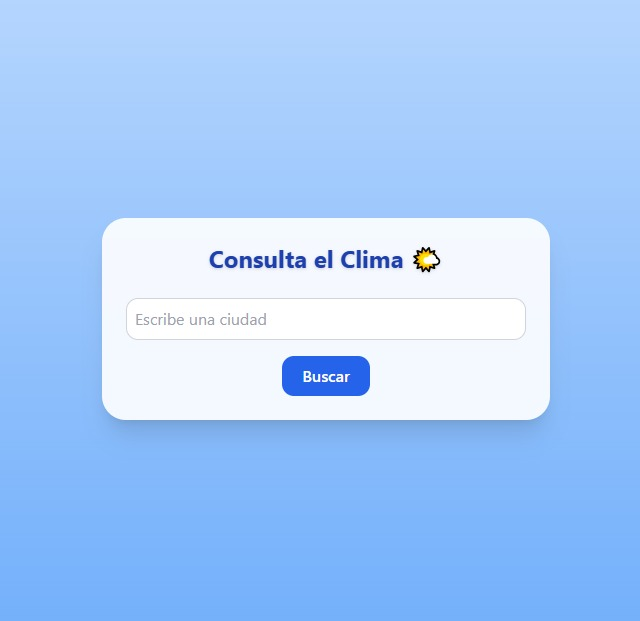

# 🌤️ App del Clima - MorenoDevs

Una aplicación web simple y responsiva para consultar el clima actual de cualquier ciudad del mundo en tiempo real.  
Desarrollada con tecnologías modernas como **HTML**, **TailwindCSS** y **JavaScript** puro.

---

## 🧠 Características

- ✅ Consulta del clima actual por ciudad.
- 🌍 Soporte en **idioma español**.
- 📷 Íconos del clima dinámicos.
- 🎨 Diseño responsivo con **TailwindCSS**.
- 🌗 Soporte para **modo oscuro / claro**.
- 💡 Año dinámico en el footer.
- 🚀 Deploy en GitHub Pages.

---

## 🛠️ Tecnologías usadas

- HTML
- TailwindCSS
- JavaScript (Vanilla JS)
- OpenWeatherMap API

---

## 📦 Cómo usar

1. Ingresa el nombre de una ciudad (ej: *Lima*, *New York*, *Madrid*).
2. Haz clic en **Buscar**.
3. Visualiza el clima actual (temperatura, humedad, descripción y viento).

---

## 🌐 Demo en vivo

[👉 Ver la app en GitHub Pages](https://josemoreno7.github.io/app-clima/)

---

## 📸 Vista Previa

---

## 👨‍💻 Autor

Desarrollado por **José Moreno**  
🔗 [Portafolio: www.morenodevs.com](https://josemoreno7.github.io/MorenoDevs/)

---

## 📝 Licencia

Este proyecto está bajo la Licencia MIT.
